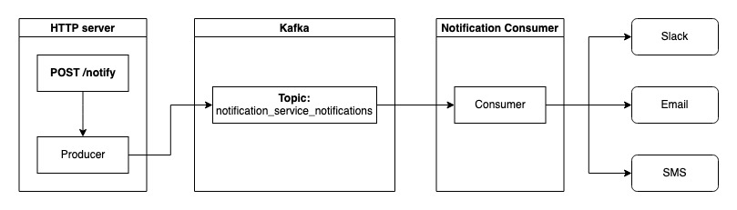

# The Design

The system consist of 3 components - HTTP server, Kafka service and a Kafka consumer:

## The HTTP server

The server exposes a single `POST /notify` endpoint that accepts a message in the following format:

    {
        "message": "<text>"
    }

The message is accepted and then sent to a Kafka topic as a Kafka message to be handled by the consumer running in the background. This offloads the server from the task of sending the message to the targeted 3rd party systems which could take time in some cases. The server could easily be horizontally scaled to handle lots of user reqeusts.

### Improvements

Right now all messages are sent without a key which results in all messages being put in the same partition. To allow the system to work with multiple partitions one should pick a `key` to be assigned to the Kafka message to ensure proper order of processing messages coming from the same source. The key could be either a user id or for example an IP address of the API caller.

## The Kafka cluster

The Kafka cluster is now configured with a single topic called `notification_service_notifications` with a single partition. 

### Improvements

To be scaled for a production environment one could increase the number of brokers and partitions for that topic in order to be able to parallelize the processing of messages.

## The Notification Consumer

The consumer's task is to consume Kafka events from the `notification_service_notifications` topic and process them by sending the messages from the events to the configured 3rd party channels. The consumer will commit a certain Kafka message only when the message is succesfully sent to all channels without issues. If any error occurs the message will not be flagged as processed and will be retried. This covers the `at least once` SLA for sending the notification.

### Improvements

With the current implementation there is no guarantee that a single message will be sent only once to a specific channel. Consider the following scenario:

1. The message is being sent via Slack channel.
2. The sending via Email fails though for various reasons.
3. The kafka message is not being commited as processed and goes back to the queue.
4. The message is picked up again and is being sent via Slack channel a second time.

To avoid this we could implement an idempotency mechanism to keep track on which steps of the message processing have been succesfully performed and avoid retrying them. This could either be implemented in the same process of the consumer or as a proxy service between the consumer and the 3rd party channels.

Scaling the consumer depends on the number of partitions we set on the topic. To allow scaling it one must reconfigure the topic and increase the number of partitions. This will allow multiple instances of the consumer to consume messages from multiple partitions.

